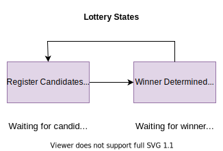
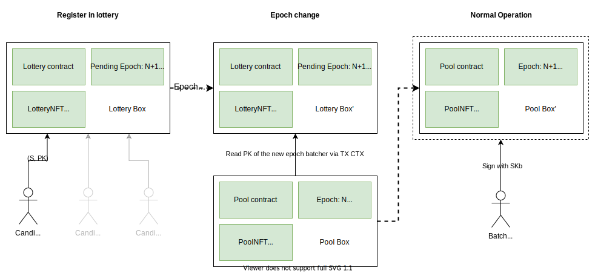
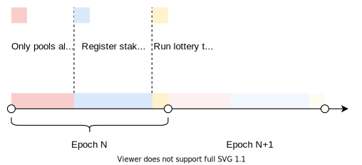

# Decentralized matching

A decentralized matching protocol for ErgoDEX.

## Problem statement

Initially ErgoDEX used a random off-chain matching which led to a certain centralization in orders processing due to 
technical advantage of some participants which were able to process most of the orders in the network faster.

## Solution

A decentralized lottery allowing to choose off-chain matcher on-chain for a certain period of time via on-chain lottery.

## Protocol description

DeMatch introduces a new primitive - a lottery contract. Lottery contact secures Lottery Box, which keeps Lottery State.

Fig. 1. Lottery states

### Lottery parameters

| Param               | Type      | Description                                                           |
|---------------------|-----------|-----------------------------------------------------------------------|
| `updateWindowLen`   | `Integer` | Length of a read-only window for seamless pool updates                |
| `registerWindowLen` | `Integer` | Length of a window when register for the next lottery is open         |
| `computeWindowLen`  | `Integer` | Length of a window withing which it's allowed to compute next matcher |
| `ticketPrice`       | `Integer` | Price of one ticket                                                   |
| `acceptedCurrency`  | `TokenId` | ID of the accepted currency                                           |

### Lottery state

| Param            | Type      | Description                                                                          |
|------------------|-----------|--------------------------------------------------------------------------------------|
| `pendingEpoch`   | `Integer` | Index of the pending epoch (for which the matcher will be selected via this lottery) |
| `winnerTicketIx` | `Integer` | Index of the winner ticket                                                           |
| `ticketRangeMin` | `Integer` | Index of the first ticket sold in this round                                         |
| `ticketRangeMax` | `Integer` | Index of the last ticket sold in this round                                          |

### Protocol bootstrap

1. A new lottery box is created with a unique NFT as an identifier, ticket tokens, an initial matcher PK
   and lottery settings (see "Lottery parameters")
2. ID of the LotteryNFT is copied to all new pools along with the initial matcher PK

### Main protocol flow

Fig. 2. Main protocol flow

1. Users willing to serve the network register in the lottery. To do that they buy lottery tickets at the defined
   price rate `ticketPrice` of `acceptedCurrency` tokens per ticket. In return to their tokens which are locked in
   the lottery box they receive tickets bundled with the starting index of the sold tickets `{rangeMin: Integer}`.
2. Once previous epoch comes to an end a winner ticket index is computed as
   `winnerTicketIx = Hash(Seed) mod (ticketRangeMax - ticketRangeMin)` and is assigned to the corresponding lottery
   state variable.
3. Once next epoch begins matcher PK for the epoch is copied to all pools from the winner ticket bundle. Lottery box
   witnesses the index of the winner ticket.
4. Other tickets are used to redeem collaterals.

Fig. 2. Lottery timeline

## Acquiring on-chain entropy 

TODO
