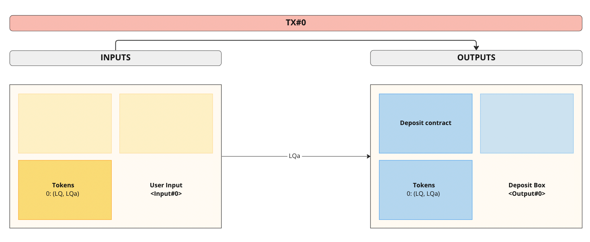
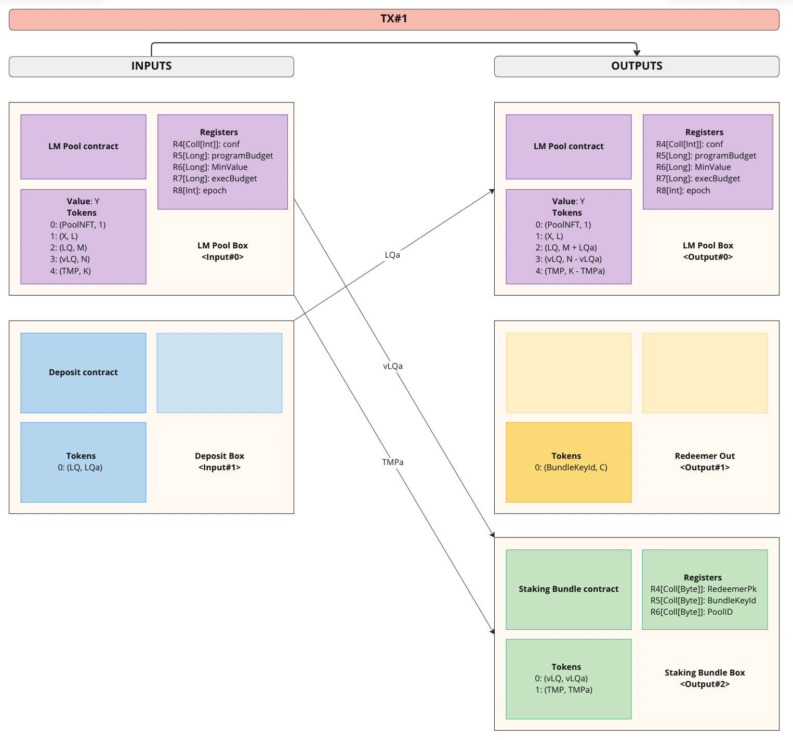
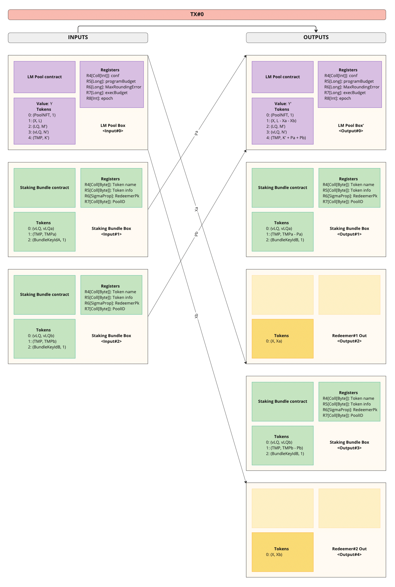
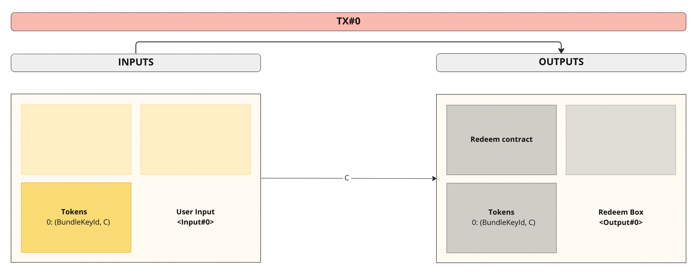
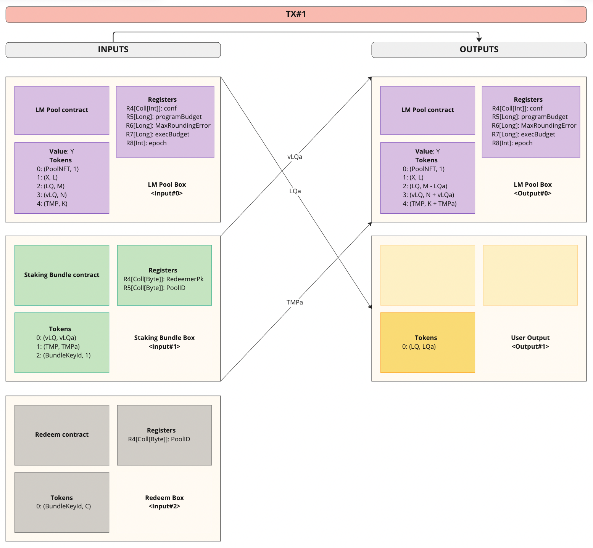

# Spectrum Finance liquidity mining protocol (Ergo)

Liqudity Mining Protocol allows anyone to set up his own liquidity mining (LM) program targeted at the desired pool on Spectrum Finance.

## Liquidity Mining Pool
Liquidity Mining (LM) Pool is represented on-chain as a UTxO with the following structure:

### Datum (LM configuration)
| Field              | Type        | Description                                                   |
|--------------------|-------------|---------------------------------------------------------------|
| `epochLen`         | `Integer`   | Length of one epoch in blocks                                 |
| `epochNum`         | `Integer`   | Number of epochs in LM program                                |
| `programStart`     | `Integer`   | Block the program starts at                                   |
| `redeemLimitDelta` | `Integer`   | Number of blocks after program to redeem without restrictions |
| `programBudget`    | `Long`      | Total LM program budget - 1L                                  |
| `maxRoundingError` | `Long`      | Total allowable residual from rounding                        |
| `execBudget`       | `Long`      | Total execution budget                                        |
| `epoch`            | `Int`       | Index of the epoch being compounded                           |

_Notes_:
* `maxRoundingError` can be estimated as `meanNumberOfParticipants * epochNum` . Since the exact number of participants is difficult to predict in advance,
It is better to choose a larger value, but it should be << `programBudget / epochNum` . If the `maxRoundingError` value is too small, the **LM program may break**,
and if the value is too large, the **distribution of rewards may be incorrect**!
* `execBudget` is **not necessary** for Self-Hosted LM Pool
* `epoch` **indexing starts from 1**

### Tokens
| Name             | Description                                                           |
|------------------|-----------------------------------------------------------------------|
| Pool ID          | An NFT to identify the pool                                           |
| Reward token     | Budget of the LM program                                              |
| LQ token         | Locked LQ tokens                                                      |
| vLQ token        | Tokens representing locked share of LQ                                |
| Temporal Token   | Left program epochs times liquidity                                   |
| Bundle Key Token | Token that is used to identify the ownership of the Staking bundle    |

_Notes_:
* **Exactly 1 LQ token must be locked in the LM Pool during initialization!!!** Otherwise, LM program **will not work!**

## Staking bundle
Staking bundle is responsible for holding vLQ and Temporal tokens (Tmp). Staking bundle script guarantees bundling of
tokens and controls Compounding and Redeem operations (see "User scenarios" below).

### Tokens
| Name             | Description                                              |
|------------------|----------------------------------------------------------|
| vLQ              | Virtual LQ token. Represents certain amount of liquidity |
| TMP              | Temporal token                                           |
| Bundle Key Token | Token to identify the ownership                          |

## User scenarios

### Creator

#### Create Self-Hosted LM Pool
Bob works on a project X with a token Xt. He would like to incentivize holders of Xt to keep their tokens in ADA/Xt pools.
To do that, Bob sets parameters `epochLen` and `epochNum` and sends `L` tokens Xt to the LM script address.
Bob should configure his own Ergo-node and off-chain bots to perform transactions.

#### Create Delegated LM Pool
Bob works on a project X with a token Xt. He would like to incentivize holders of Xt to keep their tokens in ADA/Xt pools.
To do that, Bob sets parameters `epochLen` and `epochNum` sends `L` tokens Xt to the LM script address.
In case of Delegated LM Pool he should additionally send `Y` ERGs to the LM script address as `execBudget` for executing transactions.

_Notes_:
* Deposited ERGs as `execBudget` **will be spent almost completely**!
* Once deposited during program initialization, **tokens Xt can't be redeemed**!

#### Increase execution budget
When created, the budget will be spent linearly.
However, the exact number of ERGs needed depends on the number of program participants. 
Creator will have to monitor ERGs balance and perform additional deposits.

#### General LM Pool initialization rules
When initializing an LM Pool (Self-Hosted or Delegated), the following actions **must be performed:**
1. Correct config: 
   1. `maxRoundingError` << `programBudget / epochNum`
   2. `programBudget` stored in R5 of the LM Pool Box == (Total LM program budget - 1L)

2. Initial transaction with correct tokens' amounts:

| Name            | Amount                  |
|-----------------|-------------------------|
| X               | Total LM program budget |
| LQ              | 1L                      |
| vLQ             | 0x7fffffffffffffffL     |
| TMP             | 0x7fffffffffffffffL     |

3. Initial deposit: before the start of the first LM program epoch, the creator of the LM Pool must Deposit
some LQ tokens and not Redeem received Staking Bundle until the LM program end.

_Notes_:
* Without Initial deposit the LM program will break, no one will be able to take part in it,
and the creator will lose his `programBudget`!

### Participant

#### Deposit
Alice wants to participate in LM program X. To do that, she sends `LQa` ADA/Xt LQ tokens to LM script
address and receives bundled (see "Staking bundle" section above) `vLQa` vLQ tokens + `TMPa` temporal tokens in return,
where `vLQa` - amount of LQ tokens deposited, `LQa = vLQa`, `TMPa = NumEpochsDelegated * vLQa`.
She also gets a token `(BundleKeyId, C)`, which will be needed for "Staking bundle" redemption.

_Notes_:
* If the user wants to add more LQ tokens, a new "Staking bundle" will be released
* New "Staking bundle" **can't be released until all previous epochs are compounded**
* Amount of received Bundle Key Tokens C is 0x7fffffffffffffffL - 1L

#### Reward
After each epoch rewards, allocated for each epoch, are fully distributed among stakers. 
Each staker automatically receives a reward of `EpochReward * StakerLQ / LockedLQ` tokens Xt on his wallet for each passed epoch. 
`TMPa - vLQa * NumEpochsBurned` epoch token is withdrawn from Alice's staking bundle box each time compounding happens.

### Redeem
Once Alice decided to unstake her liquidity she returns her staking bundle to LM Pool and receives proportional amount of LQ tokens
to the amount of vLQ returned. Redemption is only allowed when all previous epochs of program are compounded.

_Notes_:
* LQ tokens can't be redeemed **until all previous epochs are compounded** or until `redeemLimitDelta` is reached after the end of the program
